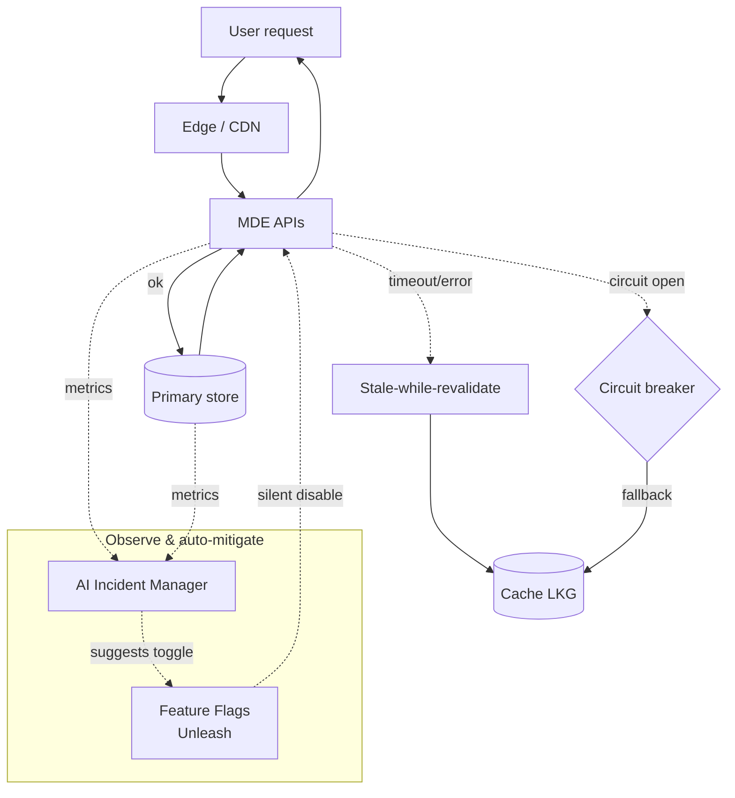

<Info>
All diagrams are available as **SVG** (rendered below) and **Excalidraw source** (editable in [excalidraw.com](https://excalidraw.com)). v3.2 (current) adds Decisions 11 and 12 plus a cross-cutting resilience view. Decisions 9–10 were subsumed into the platform-wide resilience story (see the Resilience Overview at the bottom of this page).
</Info>

## Index

### System diagrams

| # | Diagram | What it shows |
| --- | --- | --- |
| 1 | [High-Level Architecture (v3)](#high-level-architecture) | Full system: merged feed, dual Redis clusters, Kafka broadcast, data flows |
| 2 | [Feed Handler Pipeline](#feed-handler-pipeline) | Packet processing: UDP → Virtual Thread Receiver → Header Parse → Router → 6 Processors → LocalCache + Kafka + Batch HSET |
| 5 | [Temporal Platform](#temporal-platform) | Temporal Server → Dashboard → Worker Pool → Task Queues → Workflows + extensibility |
| 6 | [Service Decommission Mapping](#service-decommission) | 12 legacy services → 5 new deployment groups |

### Decision diagrams

| # | Decision | What it resolves | Status |
| --- | --- | --- | --- |
| D1 | [Replace Redis PubSub with Kafka Pull](#d1-pubsub-to-kafka) | Why Broadcast uses Kafka consumer groups, not Redis PubSub | Accepted |
| D2 | [Two Redis Clusters (Feed + API)](#d2-redis-split) | Separate hot-path feed writes from API reads | Accepted |
| D3 | [Merged Feed Architecture](#d3-merged-feed) | NSE Direct + Omnenest in one pipeline with cross-source dedup | Accepted |
| D4 | [Kafka `acks=all` + Idempotent Producer](#d4-kafka-acks) | Strongest delivery guarantees for ticks | Accepted |
| D5 | [Expiry Day Cleanup Workflow](#d5-expiry-cleanup) | Temporal workflow for expired F&O cleanup | Accepted |
| D6 | [Scrip Master in PostgreSQL Only](#d6-scrip-master) | Instrument master in PG + ConcurrentHashMap, not Redis | Accepted |
| D7 | [TimescaleDB for All Time-Series](#d7-timescaledb) | *(v3.0 — superseded in v3.1: consolidated onto ClickHouse)* | **Superseded** |
| D8 | [Historical Data Migration via Temporal](#d8-historical-migration) | How to backfill v1 → v2 storage safely | Accepted |
| D11 | [AI-Powered Incident Manager (from Day 1)](#d11-incident-manager) | Proactive anomaly detection + LLM RCA (Claude Sonnet 4.5) | Accepted (v3.2) |
| D12 | [Zero-Error UX (Graceful Degradation)](#d12-graceful-degradation) | Layered fallback so users never see errors | Accepted (v3.2) |
| — | [Resilience Overview](#resilience-overview) | How D11 + D12 compose | Reference |

<Note>
**Missing numbers:** Diagrams 3 and 4 (system) and Decisions 9 and 10 were consolidated or renumbered during the v3.1 → v3.2 refresh. The gaps are intentional — do not add stale content here.
</Note>

## How to view or edit

<Steps>
  <Step title="View">
    Click any SVG below. It renders inline in the docs.
  </Step>
  <Step title="Edit">
    Download the matching `.excalidraw` file, open [excalidraw.com](https://excalidraw.com), drag-and-drop the file onto the canvas, and edit.
  </Step>
  <Step title="Export & update">
    Export as SVG, replace the file under `/images/693502030/`, and commit. The docs update on push.
  </Step>
</Steps>

---

## System Diagrams (v3.2 — current)

### High-Level Architecture

Full system: merged feed, dual Redis clusters, Kafka-based broadcast, and end-to-end data flows.

*Source:* [mde-1-high-level-architecture-v3.excalidraw](/images/693502030/mde-1-high-level-architecture-v3.excalidraw)

### Feed Handler Pipeline

Packet processing inside the Feed Handler service — from UDP receive to Kafka publish and Redis HSET.

*Source:* [mde-2-feed-handler-pipeline.excalidraw](/images/693502030/mde-2-feed-handler-pipeline.excalidraw)

### Temporal Platform

Temporal server, dashboard, worker pool, task queues, and workflow catalog.

*Source:* [mde-5-temporal-platform.excalidraw](/images/693502030/mde-5-temporal-platform.excalidraw)

### Service Decommission

How 12 legacy services map to 5 new MDE deployment groups.

*Source:* [mde-6-service-decommission.excalidraw](/images/693502030/mde-6-service-decommission.excalidraw)

---

## Decision Diagrams

### D1 — Replace Redis PubSub with Kafka Pull 

Why Broadcast Service consumes from Kafka (consumer groups, replay, backpressure) instead of Redis PubSub fan-out.

*Source:* [mde-decision-1-pubsub-to-kafka.excalidraw](/images/693502030/mde-decision-1-pubsub-to-kafka.excalidraw)

### D2 — Two Redis Clusters (Feed + API) 

Separation of hot-path feed writes (Cluster 1) from high-volume API reads + leaderboards (Cluster 2).

*Source:* [mde-decision-2-redis-split.excalidraw](/images/693502030/mde-decision-2-redis-split.excalidraw)

### D3 — Merged Feed Architecture 

Both NSE Direct and Omnenest feed into the same pipeline with cross-source dedup (replaces the older 85/15 traffic split).

*Source:* [mde-decision-3-feed-merge.excalidraw](/images/693502030/mde-decision-3-feed-merge.excalidraw)

### D4 — Kafka `acks=all` + Idempotent Producer 

Strongest delivery guarantees for market-data events, with the ~1ms latency trade-off accepted.

*Source:* [mde-decision-4-kafka-acks.excalidraw](/images/693502030/mde-decision-4-kafka-acks.excalidraw)

### D5 — Expiry Day Cleanup Workflow 

Temporal workflow that cleans up expired F&O contracts from Redis and recalculates dependent metrics.

*Source:* [mde-decision-5-expiry-cleanup.excalidraw](/images/693502030/mde-decision-5-expiry-cleanup.excalidraw)

### D6 — Scrip Master in PostgreSQL Only 

Instrument master in PostgreSQL + in-memory `ConcurrentHashMap` instead of Redis.

*Source:* [mde-decision-6-scrip-master.excalidraw](/images/693502030/mde-decision-6-scrip-master.excalidraw)

### D7 — TimescaleDB for All Time-Series 

<Warning>
**Superseded in v3.1.** TimescaleDB was consolidated onto **ClickHouse ReplacingMergeTree + 4 materialized-view rollups**. The diagram is kept for historical context; it does not reflect the current storage layout. See [Candles v2](/components/candles-v2) and [Migration Overview](/migration/overview) for the current design.
</Warning>

*Source:* [mde-decision-7-timescaledb.excalidraw](/images/693502030/mde-decision-7-timescaledb.excalidraw)

### D8 — Historical Data Migration via Temporal 

Backfill strategy for v1 → v2 storage, modelled as a Temporal workflow (resumable, idempotent, observable).

*Source:* [mde-decision-8-historical-migration.excalidraw](/images/693502030/mde-decision-8-historical-migration.excalidraw)

### D11 — AI-Powered Incident Manager (from Day 1) 

Proactive anomaly detection + LLM-driven root-cause analysis (Claude Sonnet 4.5). Platform-wide from Day 1.

*Source:* [mde-decision-11-incident-manager.excalidraw](/images/693502030/mde-decision-11-incident-manager.excalidraw)

### D12 — Zero-Error UX (Graceful Degradation) 

Layered fallback: stale-while-revalidate, circuit breakers (Resilience4j), silent feature flags (Unleash), request hedging. Users never see error popups.

*Source:* [mde-decision-12-graceful-degradation.excalidraw](/images/693502030/mde-decision-12-graceful-degradation.excalidraw)

---

## Resilience Overview 

Cross-cutting view of how MDE resilience layers compose. Ties Decisions 11 and 12 together and shows where each protection point lives in the request/write paths.

*Source:* [mde-decision-resilience-layers.excalidraw](/images/693502030/mde-decision-resilience-layers.excalidraw)

### How the layers compose

