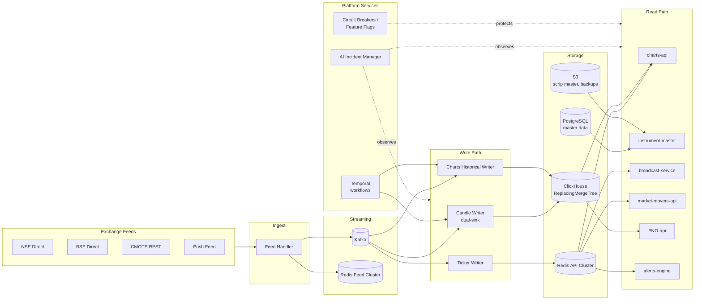

## What this engine does

The Market Data Engine (MDE) is the **single authoritative source of market data** for the Paytm Money Pro platform. Every price on every screen — LTP, OHLC, candles, option Greeks, market movers, corporate-action-adjusted history — originates here. No other system connects directly to exchange feeds.

See the [Introduction](/introduction) for the full data scope and design philosophy.

## System in one picture

See **[Architecture Diagrams](/architecture/diagrams)** for the full set (12 decision diagrams + end-to-end flows).

## Core components

Verified against the `market-data-engine` monorepo (`main`). See **[Service Catalog](/architecture/service-catalog)** for Spring application classes, per-service endpoints, and storage details.

| Layer | Service | Purpose |
| --- | --- | --- |
| Ingest | **feed-handler** *(8082)* | NSE/BSE multicast (6 UDP streams) → decode → cross-source dedup → Kafka |
| Ingest | **publisher** *(8083)* | Tick consumer → Redis Feed snapshots + Lua atomic 52-wk H/L + OHLC |
| Platform | **Kafka 3.8.0** | 6 tick topics + 5 control/audit topics ([Kafka topics](/data-apis/kafka-topics)) |
| Platform | **Redis 7.4** (Feed + API) | Feed cluster 6380, API cluster 6381 ([Redis keys](/data-apis/redis-keys)) |
| Write v2 | **candle-writer** *(8086)* ⭐ | **Dual-sink**: Redis running (5s/15s/30s/1m) + direct ClickHouse INSERT of closed 1m. **No Kafka produce.** Cascades higher intervals to Redis only; ClickHouse MVs roll up. |
| Write v1 | **charts-writer** *(8086)* | **Legacy** — writes TimescaleDB, produces `mde-candles-1m`. Kept on `main` for rollback. |
| Write v1 | **charts-historical-writer** *(8090)* | **Legacy** — consumes `mde-candles-1m`, batch-INSERT to ClickHouse. Kept for rollback. |
| Write | **fno-data-writer** *(8085)* | Option chain + Greeks + PCR + Max Pain + CPR |
| Write | **market-movers-writer** *(8084)* | Gainers/losers — Redis zsets |
| Read | **charts-api** *(8086)* | `GET /v1/candles/{token}`, `/v1/running-candles/{token}`, `POST /v1/price-charts` (UDF), `GET /v1/index` |
| Read | **instrument-master** *(8081)* | Scrip master, companies, search, CA webhook; produces `mde-instrument-master-events`, `mde-corporate-actions` |
| Read | **broadcast-service** *(8087)* | WebSocket `/ws/feed` — unique Kafka group-id per pod |
| Platform | **Temporal 1.26.2** | Workflows: scrip refresh, pre-market setup, reconciliation, CA propagation |
| Platform | **premarket-scheduler** *(8086)* | Temporal worker + `TRD_DAY` flag gate |
| Platform | **recon-service** *(8089)* | OHLCV reconciliation workflow → `mde-recon-reports`. Still reads TimescaleDB for legacy source comparison. |
| Platform | **incident-manager** *(8092)* | AlertManager webhook → Jira + Slack + timeline; produces `mde-feed-anomalies` |

<Warning>
**TimescaleDB is still live in 3 services**: `charts-writer` (primary candle store, legacy v1), `recon-service` (reads legacy 1m for reconciliation), `instrument-master` (read-only chart proxy). v2 cut-over completes after the bake-off + retention-window pass.
</Warning>

Detail: **[Service Catalog](/architecture/service-catalog)** (source-of-truth), **[Components Part 1](/components/part1-feed-to-charts)**, **[Components Part 2](/components/part2-fno-movers-alerts)**. Candles v2 is at **[Candles v2](/components/candles-v2)**.

## Storage decisions at a glance

| Concern | Choice | Why |
| --- | --- | --- |
| Running candle state | Redis (hash per symbol/tf) | Sub-ms reads; rebuildable from closed bars + ticks on cold start |
| Closed bars (1m…1M) | ClickHouse ReplacingMergeTree + 4 MVs | Column-store scan speed; MV rollups remove the old Charts Data Collector |
| Time-series long-term | **TimescaleDB removed** — consolidated onto ClickHouse | Single TSDB; fewer moving parts (storage unification) |
| Master data | PostgreSQL 16 | Scrip master, user alerts, incident registry |
| Scrip master distribution | S3 (versioned) | Downstream services pull nightly snapshots |
| Cache / leaderboards | Redis API Cluster | Movers zsets, LTP LKG, session state |

The rationale for Redis + Kafka (and not one-or-the-other) is in **[Kafka vs Redis Defense](/decisions/kafka-vs-redis)**.

## Request paths

<CardGroup cols={2}>
  <Card title="Live LTP / Snapshot" icon="bolt">
    UI → broadcast-service (WS) → Redis API. Fallback: charts-api `/v1/price-charts`.
  </Card>
  <Card title="Charts — Running Candle" icon="chart-line">
    UI → charts-api `/v1/running-candles` → Redis API (hash read). Sub-10ms typical.
  </Card>
  <Card title="Charts — Historical" icon="clock-rotate-left">
    UI → charts-api `/v1/candles?source={redis|clickhouse}` → ClickHouse MV rollup for the requested timeframe.
  </Card>
  <Card title="Option Chain / Greeks" icon="table">
    UI → FNO-api → Redis API (hot chain) + ClickHouse (settles, OI time-series).
  </Card>
</CardGroup>

## Reliability & resilience

- **Zero-Error UX**: Users never see errors. Layered fallback, stale-while-revalidate, circuit breakers (Resilience4j), silent feature flags (Unleash), request hedging.
- **AI-Powered Incident Manager**: Proactive detection + LLM-driven RCA from Day 1. Catches anomalies before users feel them.
- **Self-healing**: Feed Handler auto-reconnects, candle writer auto-rebuilds running state from Kafka + ClickHouse on cold start.
- **Temporal-first migrations**: Historical backfill and scrip master refresh run as Temporal workflows — resumable, idempotent, observable.

Full details: **[Components Part 2 §6.20–6.21](/components/part2-fno-movers-alerts)**.

## What's new

<Tabs>
  <Tab title="(current)">
    - **AI-Powered Incident Manager** — proactive anomaly detection + LLM RCA (Claude Sonnet 4.5)
    - **Zero-Error UX** — graceful degradation, stale-while-revalidate, Resilience4j + Unleash
    - Decisions 11 & 12 added to [Architecture Diagrams](/architecture/diagrams)
  </Tab>
  <Tab title="Earlier design iterations">
    - **TimescaleDB removed** — unified time-series on ClickHouse
    - **Candles v2** shipped: dual-sink writer, Redis running + ClickHouse closed, charts-api `source=` switch, UDF-compat `/v1/price-charts`
    - Charts Data Collector service eliminated — ClickHouse MVs replace manual rollups
  </Tab>
  <Tab title="Legacy paths (deprecated)">
    - Candle storage on TimescaleDB — removed. See [Migration Overview](/migration/overview).
    - Redis-only architecture (pre-Kafka) — superseded; see [Kafka vs Redis](/decisions/kafka-vs-redis).
  </Tab>
</Tabs>

## Where to go next

<CardGroup cols={2}>
  <Card title="Architecture Diagrams" icon="sitemap" href="/architecture/diagrams">
    12 decision diagrams + end-to-end flows
  </Card>
  <Card title="Components" icon="boxes-stacked" href="/components/part1-feed-to-charts">
    Deep dive into each service
  </Card>
  <Card title="Operations" icon="gauge-high" href="/operations/devops-guide">
    Provisioning, runbooks, prod readiness
  </Card>
  <Card title="Migration" icon="truck-ramp-box" href="/migration/overview">
    Cut-over plan from legacy
  </Card>
</CardGroup>
