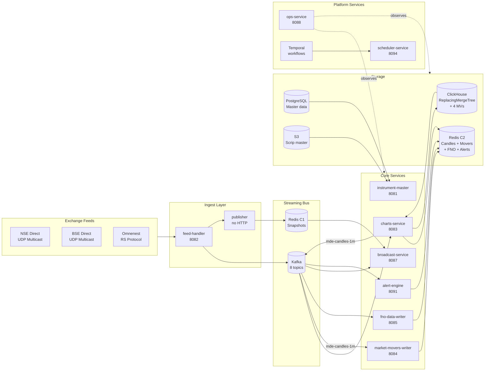

## What this engine does

The Market Data Engine (MDE) is the **single authoritative source of market data** for the Paytm Money Pro platform. Every price on every screen — LTP, OHLC, candles, option Greeks, market movers, corporate-action-adjusted history — originates here. No other system connects directly to exchange feeds.

See the [Introduction](/introduction) for the full data scope and design philosophy.

## System in one picture

See **[Architecture Diagrams](/architecture/diagrams)** for the full set (12 decision diagrams + end-to-end flows).

## Core components (9 services)

Consolidated from the original 15 services. See **[Service Catalog](/architecture/service-catalog)** for Spring application classes, per-service endpoints, and storage details.

| # | Service | Port (HTTP/Mgmt) | Purpose |
| --- | --- | --- | --- |
| 1 | **feed-handler** | 8082 / 9082 | NSE/BSE multicast (6 UDP streams) → LZO decode → OI injection → cross-source dedup → zero-LTP fallback → Kafka |
| 2 | **publisher** | — / 9082 | Tick consumer → Redis C1 snapshots (FEED_PP, OHLC, 52WK) + Lua atomics. Market status key, BSE circuit limits from MBP. No HTTP port. |
| 3 | **instrument-master** | 8081 / 9081 | Scrip master, company info (absorbs company-fundamentals), search, CA webhook; produces `mde-instrument-master-events`, `mde-corporate-actions` |
| 4 | **broadcast-service** | 8087 / 9087 | WebSocket `/ws/feed` — unique Kafka group-id per pod, market status broadcasting, heartbeat, per-pod connection limit, inverted subscription index |
| 5 | **charts-service** | 8083 / 9083 | Merged from charts-writer + charts-historical-writer + charts-api. Kafka ticks → Redis C2 (1m hot candles, Hash + ZSET, 2-3d TTL with AOF) + ClickHouse batch insert (historical). Produces `mde-candles-1m`. Serves `GET /v1/candles`, `/v1/running-candles`, `POST /v1/price-charts` (UDF). Partition-based horizontal scaling. |
| 6 | **market-movers-writer** | 8084 / 9084 | Consumes `mde-candles-1m` topic (not raw ticks) → Redis C2 sorted sets for gainers/losers/volume/value |
| 7 | **fno-data-writer** | 8085 / 9085 | Option chain + Greeks + IV + Max Pain + ATM Straddle + PCR (OI + Volume) + Black-76 (index options) + day-over-day changes + BSE F&O → Redis C2 |
| 8 | **alert-engine** | 8091 / 9091 | Price/volume alerts, 52W conditions using BOD reference data, Redis index reconciliation on restart → Redis C2 |
| 9 | **scheduler-service** | 8094 / 9094 | Merged from premarket-scheduler + corporate-action-processor. Temporal worker + TRD_DAY gate. Direct exchange URL downloads, BSE bhavcopy, NSE F&O bhavcopy, F&O ban list, BSE circuit limits (DP file). Corporate action T-1 pre-computation with shadow tables and atomic partition swap. |
| — | **ops-service** | 8088 / 9088 | Merged from incident-manager + recon-service. Autonomous operations hub with self-healing, market-hours awareness. LLM-driven RCA (Claude Sonnet 4.5), OHLCV reconciliation → `mde-recon-reports`, AlertManager webhook → Jira + Slack + timeline. |

<Info>
**Platform infrastructure:** Kafka 3.8.0 (8 topics — see [Kafka topics](/data-apis/kafka-topics)), Redis 7.4 C1 (snapshots, port 6380) + C2 (candles/movers/FNO/alerts, port 6381) — see [Redis keys](/data-apis/redis-keys), ClickHouse (ReplacingMergeTree + 4 materialized view rollups), PostgreSQL 16, Temporal 1.26.2.
</Info>

Detail: **[Service Catalog](/architecture/service-catalog)** (source-of-truth), **[Components Part 1](/components/part1-feed-to-charts)**, **[Components Part 2](/components/part2-fno-movers-alerts)**.

## Storage decisions at a glance

| Store | What Lives Here | Why |
| --- | --- | --- |
| **Redis Cluster 1 (C1)** | Real-time snapshots — FEED_PP, OHLC, 52WK, circuit limits, market status | Sub-ms reads for live data; Lua scripts for atomic updates |
| **Redis Cluster 2 (C2)** | 1-minute candles (Hash per candle + ZSET index per instrument, 2-3 day TTL with AOF persistence), market movers ZSETs, FNO chains, alert indices | Hot candle store; sub-ms reads for running/recent candles; AOF for durability |
| **ClickHouse** | Historical candles (all intervals), recon data, corporate action audit. ReplacingMergeTree for dedup + 4 materialized view rollups (5m, 15m, 1h, 1d) | Column-store scan speed; MV rollups replace manual aggregation; 10-year retention |
| **PostgreSQL 16** | Instrument master data, user alerts, corporate actions metadata, ops incidents | Relational master data, transactional writes |
| **S3** | Scrip master snapshots (versioned), backups | Downstream services pull nightly |
| **Kafka** | 8 topics for inter-service messaging (ticks, candles, instruments, corporate actions, recon, anomalies, alerts, control) | Durable stream; replay as ultimate fallback in three-layer durability model |

<Tip>
**Three-layer durability for candles:** Redis AOF (hot) → ClickHouse batch insert (durable) → Kafka replay as ultimate fallback. No data loss even if Redis restarts.
</Tip>

The rationale for Redis + Kafka (and not one-or-the-other) is in **[Kafka vs Redis Defense](/decisions/kafka-vs-redis)**.

## Request paths

<CardGroup cols={2}>
  <Card title="Live LTP / Snapshot" icon="bolt">
    UI → broadcast-service (WS) → Redis C1. Fallback: charts-service `/v1/price-charts`.
  </Card>
  <Card title="Charts — Running Candle" icon="chart-line">
    UI → charts-service `/v1/running-candles` → Redis C2 (hash read). Sub-10ms typical.
  </Card>
  <Card title="Charts — Historical" icon="clock-rotate-left">
    UI → charts-service `/v1/candles` → Redis C2 (recent 2-3 days) or ClickHouse MV rollup (older).
  </Card>
  <Card title="Option Chain / Greeks" icon="table">
    UI → fno-data-writer → Redis C2 (hot chain + Max Pain + ATM Straddle + PCR).
  </Card>
</CardGroup>

## Reliability & resilience

- **Zero-Error UX**: Users never see errors. Layered fallback, stale-while-revalidate, circuit breakers (Resilience4j), silent feature flags (Unleash), request hedging.
- **Autonomous ops-service**: Proactive anomaly detection + LLM-driven RCA (Claude Sonnet 4.5) with market-hours awareness. Self-healing actions before users notice.
- **Self-healing**: Feed Handler auto-reconnects, charts-service auto-rebuilds running candle state from Kafka + ClickHouse on cold start. Alert-engine reconciles Redis indices on restart.
- **Three-layer durability**: Redis AOF → ClickHouse batch insert → Kafka replay. No single point of failure for candle data.
- **Temporal-first migrations**: Historical backfill, scrip master refresh, corporate action pre-computation all run as Temporal workflows — resumable, idempotent, observable.
- **Production observability**: Prometheus metrics on every service (port 9xxx), distributed tracing, 8 Grafana dashboards.

Full details: **[Components Part 2 §6.20–6.21](/components/part2-fno-movers-alerts)**.

## What's new

<Tabs>
  <Tab title="Current (v4.0)">
    - **9 consolidated services** (down from 15) — charts-service (3-in-1), scheduler-service (2-in-1), ops-service (2-in-1), instrument-master absorbs company-fundamentals
    - **ClickHouse + Redis replaces TimescaleDB** — 1m candles in Redis C2 (hot, AOF), historical in ClickHouse (ReplacingMergeTree + 4 MV rollups), three-layer durability
    - **FNO analytics suite** — Max Pain, ATM Straddle, PCR (OI + Volume), day-over-day changes, BSE F&O, Black-76 for index options
    - **Corporate action pre-computation** — T-1 shadow tables with atomic partition swap
    - **Autonomous ops-service** — self-healing, market-hours awareness, LLM-driven RCA (Claude Sonnet 4.5)
    - **Production observability** — Prometheus metrics on all services, distributed tracing, 8 Grafana dashboards
    - **Feed handler enhancements** — LZO decompression, OI injection, zero-LTP fallback, cross-minute re-send, prev-close enrichment for indices
    - **38 gap-closure tasks** completed across all services
  </Tab>
  <Tab title="Earlier design iterations">
    - **Zero-Error UX** — graceful degradation, stale-while-revalidate, Resilience4j + Unleash
    - **AI-Powered Incident Manager** — proactive anomaly detection + LLM RCA (now part of ops-service)
    - Charts Data Collector service eliminated — ClickHouse MVs replace manual rollups
  </Tab>
  <Tab title="Legacy paths (removed)">
    - TimescaleDB candle storage — fully removed, replaced by Redis C2 + ClickHouse. See [Migration Overview](/migration/overview).
    - charts-writer, charts-historical-writer, charts-api — consolidated into charts-service.
    - premarket-scheduler, corporate-action-processor — consolidated into scheduler-service.
    - incident-manager, recon-service — consolidated into ops-service.
    - company-fundamentals — absorbed into instrument-master.
    - Redis-only architecture (pre-Kafka) — superseded; see [Kafka vs Redis](/decisions/kafka-vs-redis).
  </Tab>
</Tabs>

## Where to go next

<CardGroup cols={2}>
  <Card title="Architecture Diagrams" icon="sitemap" href="/architecture/diagrams">
    12 decision diagrams + end-to-end flows
  </Card>
  <Card title="Components" icon="boxes-stacked" href="/components/part1-feed-to-charts">
    Deep dive into each service
  </Card>
  <Card title="Operations" icon="gauge-high" href="/operations/devops-guide">
    Provisioning, runbooks, prod readiness
  </Card>
  <Card title="Migration" icon="truck-ramp-box" href="/migration/overview">
    Cut-over plan from legacy
  </Card>
</CardGroup>
