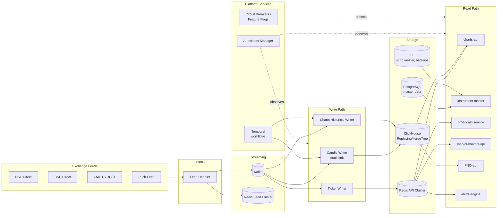

## What this engine does

The Market Data Engine (MDE) is the **single authoritative source of market data** for the Paytm Money Pro platform. Every price on every screen — LTP, OHLC, candles, option Greeks, market movers, corporate-action-adjusted history — originates here. No other system connects directly to exchange feeds.

See the [Introduction](/introduction) for the full data scope and design philosophy.

## System in one picture

See **[Architecture Diagrams](/architecture/diagrams)** for the full set (12 decision diagrams + end-to-end flows).

## Core components

| Layer | Service | Purpose |
| --- | --- | --- |
| Ingest | **feed-handler** | Consumes NSE/BSE/CMOTS/Push, normalizes ticks, fans out to Kafka + Redis Feed |
| Platform | **Kafka** | Durable event bus for ticks, corporate actions, alerts |
| Platform | **Redis Feed Cluster** | Hot-path pub/sub for live ticks consumed by APIs |
| Write | **candle-writer** | Dual-sink: Redis running candles + ClickHouse closed candles |
| Write | **charts-historical-writer** | Backfills & corrects historical bars (Temporal workflow) |
| Write | **ticker-writer** | Persists last-known-good LTP into Redis API |
| Read | **charts-api** | Serves `GET /v1/candles`, `GET /v1/running-candles`, `POST /v1/price-charts` (UDF-compat) |
| Read | **broadcast-service** | WebSocket fan-out to UI |
| Read | **instrument-master** | Scrip master, segments, company info, CA events |
| Read | **market-movers-api** | Gainers, losers, 52-week hitters — Redis zsets |
| Read | **FNO-api** | Option chain, Greeks, PCR, Max Pain, ATM Straddle, CPR |
| Read | **alerts-engine** | Price/volume alerts — user- and system-level |
| Platform | **Temporal** | Orchestrates migration, scrip master refresh, corporate actions, reconciliation |
| Platform | **AI Incident Manager** | Proactive anomaly detection + LLM RCA (Claude Sonnet 4.5) |

Detail: **[Components Part 1](/components/part1-feed-to-charts)** and **[Components Part 2](/components/part2-fno-movers-alerts)**. Candles v2 (the current production path) is documented separately at **[Candles v2](/components/candles-v2)**.

## Storage decisions at a glance

| Concern | Choice | Why |
| --- | --- | --- |
| Running candle state | Redis (hash per symbol/tf) | Sub-ms reads; rebuildable from closed bars + ticks on cold start |
| Closed bars (1m…1M) | ClickHouse ReplacingMergeTree + 4 MVs | Column-store scan speed; MV rollups remove the old Charts Data Collector |
| Time-series long-term | **TimescaleDB removed** — consolidated onto ClickHouse | Single TSDB; fewer moving parts (v3.0 unification) |
| Master data | PostgreSQL 16 | Scrip master, user alerts, incident registry |
| Scrip master distribution | S3 (versioned) | Downstream services pull nightly snapshots |
| Cache / leaderboards | Redis API Cluster | Movers zsets, LTP LKG, session state |

The rationale for Redis + Kafka (and not one-or-the-other) is in **[Kafka vs Redis Defense](/decisions/kafka-vs-redis)**.

## Request paths

<CardGroup cols={2}>
  <Card title="Live LTP / Snapshot" icon="bolt">
    UI → broadcast-service (WS) → Redis API. Fallback: charts-api `/v1/price-charts`.
  </Card>
  <Card title="Charts — Running Candle" icon="chart-line">
    UI → charts-api `/v1/running-candles` → Redis API (hash read). Sub-10ms typical.
  </Card>
  <Card title="Charts — Historical" icon="clock-rotate-left">
    UI → charts-api `/v1/candles?source={redis|clickhouse}` → ClickHouse MV rollup for the requested timeframe.
  </Card>
  <Card title="Option Chain / Greeks" icon="table">
    UI → FNO-api → Redis API (hot chain) + ClickHouse (settles, OI time-series).
  </Card>
</CardGroup>

## Reliability & resilience

- **Zero-Error UX (v3.2)**: Users never see errors. Layered fallback, stale-while-revalidate, circuit breakers (Resilience4j), silent feature flags (Unleash), request hedging.
- **AI-Powered Incident Manager (v3.2)**: Proactive detection + LLM-driven RCA from Day 1. Catches anomalies before users feel them.
- **Self-healing**: Feed Handler auto-reconnects, candle writer auto-rebuilds running state from Kafka + ClickHouse on cold start.
- **Temporal-first migrations**: Historical backfill and scrip master refresh run as Temporal workflows — resumable, idempotent, observable.

Full details: **[Components Part 2 §6.20–6.21](/components/part2-fno-movers-alerts)**.

## What's new

<Tabs>
  <Tab title="v3.2 (current)">
    - **AI-Powered Incident Manager** — proactive anomaly detection + LLM RCA (Claude Sonnet 4.5)
    - **Zero-Error UX** — graceful degradation, stale-while-revalidate, Resilience4j + Unleash
    - Decisions 11 & 12 added to [Architecture Diagrams](/architecture/diagrams)
  </Tab>
  <Tab title="v3.0 / v3.1">
    - **TimescaleDB removed** — unified time-series on ClickHouse
    - **Candles v2** shipped: dual-sink writer, Redis running + ClickHouse closed, charts-api `source=` switch, UDF-compat `/v1/price-charts`
    - Charts Data Collector service eliminated — ClickHouse MVs replace manual rollups
  </Tab>
  <Tab title="Legacy paths (deprecated)">
    - v1 candle storage on TimescaleDB — removed. See [Migration Overview](/migration/overview).
    - Redis-only architecture (pre-Kafka) — superseded; see [Kafka vs Redis](/decisions/kafka-vs-redis).
  </Tab>
</Tabs>

## Where to go next

<CardGroup cols={2}>
  <Card title="Architecture Diagrams" icon="sitemap" href="/architecture/diagrams">
    12 decision diagrams + end-to-end flows
  </Card>
  <Card title="Components" icon="boxes-stacked" href="/components/part1-feed-to-charts">
    Deep dive into each service
  </Card>
  <Card title="Operations" icon="gauge-high" href="/operations/devops-guide">
    Provisioning, runbooks, prod readiness
  </Card>
  <Card title="Migration" icon="truck-ramp-box" href="/migration/overview">
    Cut-over plan from legacy to v3.2
  </Card>
</CardGroup>
