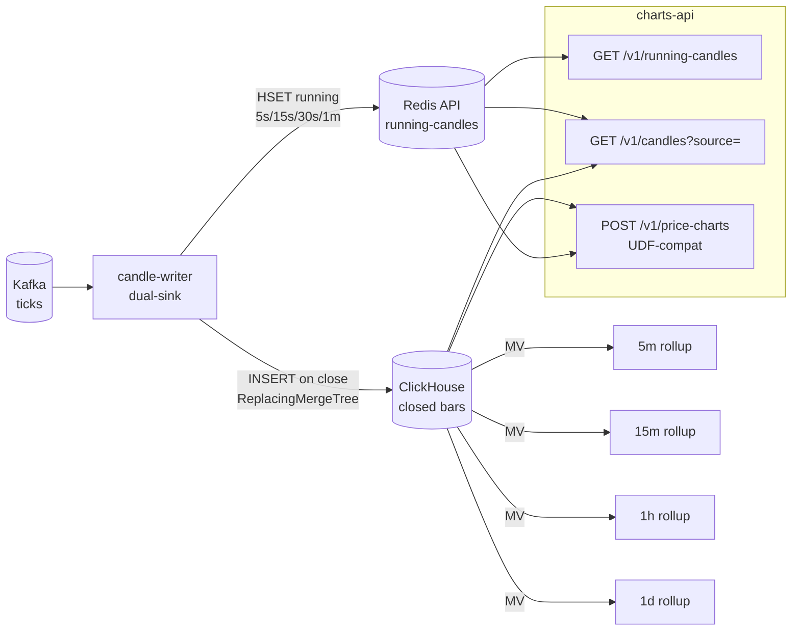

# MDE Candles v2 — Architecture + DevOps Requirements

**Status**: Shipped to `main` — staging rollout + bake-off in progress (2026-04-20)
**Supersedes**: `charts-writer` + `charts-historical-writer` + TimescaleDB as candle store
**Author**: Girish Kumar
**Owner**: MDE team

---

## 0. What changes

| Before | After |
| --- | --- |
| charts-writer → TimescaleDB (1m only) | **candle-writer → Redis + ClickHouse** (same service, dual-sink) |
| charts-historical-writer → ClickHouse (1m base, MVs for 5m+) | **Removed** — merged into candle-writer |
| No running/sub-minute candles | **Running candles (5s / 15s / 30s)** built live, served from Redis only |
| TimescaleDB for 1m reads | **Removed** — ClickHouse holds durable 1m + MV rollups |
| API serves 1m from TSDB, 5m+ from ClickHouse | **API** `source` switch: `redis` / `clickhouse` / `auto` (default) |
| MDE charts-api only serves its internal dashboard contract | **NEW**: MDE charts-api exposes a **TradingView UDF-compatible** `POST /v1/price-charts` endpoint that matches the existing `data-price-charts-api` contract verbatim — lets us swallow PML production traffic with **zero UI change** |

**Net effect**: one writer, one durable store, one hot cache. No TSDB. Running candles available for the first time. **PML UI keeps working without a single line of TradingView / iframe / chart-config change.**

### Write + read paths at a glance



---

## 1. Why this change

1. **Sub-minute running candles** are a real product gap. Intraday trading UI wants a live "current candle" that updates every tick, not just when the minute closes. Today there's no running-candle stream.
2. **Two writers consuming the same Kafka topic to produce the same 1m bars** is duplicated work and duplicated bugs. They can drift.
3. **TimescaleDB** adds a third datastore (on top of ClickHouse + Redis) for only one interval (1m). Removing it shrinks the operational surface by one primary.
4. **API source switch** lets us A/B Redis vs ClickHouse for 1m/5m/15m/1h reads in staging and keep whichever is measurably better on p99 latency + cost, without code changes on the client side.
5. **PML UI compatibility guaranteed**: we investigated the current production UI stack (§1.5 below) — the TradingView iframe hits a specific UDF-compatible REST shape and a specific WebSocket endpoint. Our v2 preserves both exactly.

---

## 1.5 Frontend compatibility — how v2 lands without breaking the current PML UI

### 1.5.1 What the production UI actually depends on (from repo audit)

Investigation of `equity-web-app` + `trading-view-platform` + `data-price-charts-api` confirmed:

- **Active charting library**: TradingView Charting Library (UDF-compatible) hosted at `https://api-eq.paytmmoney.com/equity-charts/trading-view/` (iframe).
- **Chart REST call** (from `trading-view-platform/datafeeds/historyProvider.js:61-66`):

```
POST {backend}/historical-price
body: { pmlId: <long>, fromDate: "yyyy-MM-dd", toDate: "yyyy-MM-dd", interval: "MINUTE" | "DAY" }
```
- **Response shape** (UDF, from `datafeeds/udf/src/history-provider.ts:27-34`):

```json
{ "s": "ok", "t": [unix_seconds], "o": [...], "h": [...], "l": [...], "c": [...], "v": [...] }
```
- **Supported intervals in the UI dropdown**: `MINUTE` and `DAY` only (`chartConstants.INTERVALS.MINUTE/.DAY`). No 5s/15s/30s in the dropdown today. The UI is resolution-unaware beyond these two enums.
- **Instrument identifier**: `pmlId` (Long, Paytm Money internal security ID). Not `instrumentToken`, not ISIN, not symbol.
- **Date convention**: request uses `yyyy-MM-dd`; response `t[]` is **epoch seconds** (not millis).
- **WebSocket for live ticks**: `wss://broadcast.paytmmoney.com` via RxJS `SubscriptionManager`. This is the PML broadcast endpoint, already handled by `pml-core-feed-broadcast`. **Our** `broadcast-service` is a separate service and does not replace this.
- **Empty data behaviour**: UI handles `data.length == 0` gracefully → `noData = true` → empty-state render.

### 1.5.2 The compatibility strategy

**We do NOT change the PML UI. We do NOT change** `data-price-charts-api`'s external contract. Instead, MDE `charts-api` offers the same UDF-compatible endpoint, so the PML backend can choose to route its TradingView iframe through MDE whenever they're ready — no UI work.

| UI surface | Today | With v2 |
| --- | --- | --- |
| TradingView iframe base URL | `api-eq.paytmmoney.com` → `data-price-charts-api` | **Unchanged.** Option to point at MDE `charts-api` when PML team is ready. |
| Chart REST call | `POST /historical-price` | **Unchanged.** MDE `charts-api` now exposes the same `POST /v1/price-charts` shape (shipped in `bb3f8ff`). |
| `pmlId` → candle source | `pml-core-tick-data-service` (Postgres) + `pml-core-price-charts-collector` (ES) | **Transparently served from MDE Redis + ClickHouse via pmlId→instrumentToken mapping in MDE charts-api.** UI sees no difference. |
| Live ticks WebSocket | `wss://broadcast.paytmmoney.com` (pml-core-feed-broadcast) | **Unchanged.** Not part of this scope. |
| UI JavaScript / React code | — | **Zero changes required.** |

### 1.5.3 Two read surfaces inside MDE charts-api

- **Legacy/internal** `GET /v1/candles/{token}?interval=5s|15s|30s|1m|5m|15m|1h|1d&from=<ms>&to=<ms>&source=<redis|clickhouse|auto>` — used by the MDE internal dev dashboard (`dashboard.html`) and future internal tooling. `token` is `"NSE:EQUITY:2885"` format. Range in epoch millis. Response: array of candle objects.
- **UDF-compat** `POST /v1/price-charts` — body `{pmlId, fromDate, toDate, interval ∈ {MINUTE, DAY}}` → UDF columnar response `{s, t[], o[], h[], l[], c[], v[]}`. Used by (future) PML TradingView migration. `pmlId → instrumentToken` handled inside `charts-api` via a 15-minute cache against instrument-master.

Both endpoints read from the same backing store (Redis Cluster 1 + ClickHouse). Only the **request/response shape** differs. Shipped in `bb3f8ff`.

### 1.5.4 Running candles — new side endpoint

`GET /v1/running-candles/{token}?interval=5s|15s|30s|1m` — pure Redis read, single current bucket, JSON response. **The PML UI doesn't use this today** because the TradingView dropdown doesn't include sub-minute intervals. We ship the server-side capability; UI adopts it when the PML team decides to add sub-minute resolutions to their chart. Shipped in `bb3f8ff`.

### 1.5.5 Migration path for PML routing (when they're ready)

1. PML team points `ENDPOINTS.EQUITY_CHARTS.HISTORICAL_PRICE` config in `trading-view-platform` at MDE `charts-api`'s `/v1/price-charts` path.
2. MDE `charts-api` returns identical UDF response to what `data-price-charts-api` returns today.
3. `data-price-charts-api` stays live as a hot fallback for 30 days, then decommissioned.
4. `pml-core-price-charts-collector` (daily ES aggregation batch) stays live as a cold backup for 60 days, then decommissioned.

**No UI change. No TradingView re-integration. No mobile app change.**

---

## 2. Architecture

```
Kafka  pml-marketfeed-*-ticks  (unchanged)
   │
   │  @KafkaListener(topicPattern=".*-ticks", groupId=mde-candle-writer)
   │  partitions shard across pods — each pod owns a disjoint set of instruments
   ▼
candle-writer  (replaces charts-writer + charts-historical-writer)  — shipped in 22b566c
   │
   │  per-tick in-memory aggregation, keyed by
   │    (instrumentToken, interval, floor(ts, interval))
   │  for intervals: 5s, 15s, 30s, 1m
   │
   ├─► every 1s:  flush RUNNING candles (5s/15s/30s/current-1m partial)
   │                 → Redis Cluster 1 (hot, TTL short)
   │
   ├─► on minute rollover:
   │     the just-closed 1m bucket →
   │       ├─► Redis Cluster 1 (key: CANDLE:1m:{token}:{epoch_minute}, TTL 3 h)
   │       └─► ClickHouse  INSERT INTO mde.candles_1m
   │                            (ReplacingMergeTree — idempotent) — schema shipped in 35560c0
   │
   └─► Kafka offset committed AFTER both sinks ack
                          │
                          ▼
                   ClickHouse candles_1m
                          │
                          ├──▶ MV → candles_5m   (AggregatingMergeTree)
                          ├──▶ MV → candles_15m
                          ├──▶ MV → candles_1h
                          └──▶ MV → candles_1d

Read path:  (charts-api — shipped in bb3f8ff)
charts-api
   │
   ├── GET  /v1/candles/{token}?interval=<i>&source=<redis|clickhouse|auto>   (internal format)
   ├── POST /v1/price-charts  {pmlId, fromDate, toDate, interval}             (UDF-compat for PML)
   └── GET  /v1/running-candles/{token}?interval=<5s|15s|30s|1m>              (new)
   │
   │  running (5s/15s/30s): Redis only (ClickHouse never stores these)
   │  1m/5m/15m/1h:         Redis if source=redis, ClickHouse if source=clickhouse,
   │                        AUTO = Redis for last N hours, ClickHouse for older
   │  1d+ or > 30 days ago: ClickHouse only (Redis TTL won't cover it)
   ▼
Dashboard / PML TradingView iframe / mobile apps
```

---

## 3. Redis schema

All keys in **Redis Cluster 1** (feed-snapshots), which already exists. No new Redis cluster needed.

### 3.1 Running candles (sub-minute)

| Interval | Key | Type | TTL | Example |
| --- | --- | --- | --- | --- |
| 5s | `CANDLE:RUN:5s:{token}` | Hash | 120 s | `CANDLE:RUN:5s:NSE:EQUITY:2885` |
| 15s | `CANDLE:RUN:15s:{token}` | Hash | 120 s | `CANDLE:RUN:15s:NSE:EQUITY:2885` |
| 30s | `CANDLE:RUN:30s:{token}` | Hash | 120 s | `CANDLE:RUN:30s:NSE:EQUITY:2885` |
| **Current partial 1m** | `CANDLE:RUN:1m:{token}` | Hash | 120 s | — |

Hash fields: `bucket_start` (epoch ms), `open`, `high`, `low`, `close`, `volume`, `tick_count`, `last_updated_ts`.

**Write cadence**: candle-writer flushes every 1 s via Redis pipelined `HSET`. Coalesces multiple ticks into one write per bucket.

**Read access**: future WebSocket subscribers; REST `/v1/running-candles/{token}?interval=5s`.

**Memory footprint**: 90k instruments × 4 intervals × ~120 B per hash = **~43 MB steady-state**. Trivial.

### 3.2 Closed 1m + rollups (hot cache)

| Interval | Key | Type | TTL | Why TTL |
| --- | --- | --- | --- | --- |
| 1m | `CANDLE:1m:{token}:{epoch_minute}` | Hash | 3 h | Intraday chart range |
| 5m | `CANDLE:5m:{token}:{epoch_5m}` | Hash | 6 h | Intraday |
| 15m | `CANDLE:15m:{token}:{epoch_15m}` | Hash | 1 d | Intraday + prior session |
| 1h | `CANDLE:1h:{token}:{epoch_h}` | Hash | 7 d | Multi-session charts |

Fields same as running: `open, high, low, close, volume`.

**Important**: 1m rows are written by `candle-writer` directly. 5m/15m/1h rows are **computed by candle-writer on the rollover boundary** and written to Redis alongside the write to ClickHouse. Aggregation logic lives in one place = candle-writer.

**ZSET index for range queries**: `CANDLE:1m:{token}:index` as a sorted set keyed by `epoch_minute` → `CANDLE:1m:{token}:{epoch_minute}` member. Lets charts-api do `ZRANGEBYSCORE` to get all 1m candles in a window, then `HMGET` each.

**Memory footprint** (worst case, 90k instruments × all rollups × TTLs):

- 1m × 3 h × 90k = 16 M keys × 200 B = **~3.2 GB**
- 5m × 6 h × 90k = 6.5 M × 200 B = ~1.3 GB
- 15m × 1 d × 90k = 8.6 M × 200 B = ~1.7 GB
- 1h × 7 d × 90k = 15 M × 200 B = ~3 GB
- Total: **~10 GB**

Redis Cluster 1 node size MUST be raised — see §10.

### 3.3 Redis cluster capacity changes

| Before | After |
| --- | --- |
| 3 shards × `cache.r7g.large` (13 GB) = ~30 GB headroom | **3 shards ×** `cache.r7g.xlarge` (26 GB) = ~60 GB headroom |

This gives 5× the candle payload + existing snapshots + future growth.

---

## 4. ClickHouse schema (simplified — TSDB removed)

### 4.1 Base table  (shipped in 35560c0, migration cf966ec)

```sql
CREATE TABLE mde.candles_1m
(
    instrument_token  LowCardinality(String),
    exchange          LowCardinality(String),
    segment           LowCardinality(String),
    bucket_start      DateTime64(3, 'Asia/Kolkata'),
    open              Float64,
    high              Float64,
    low               Float64,
    close             Float64,
    volume            UInt64,
    tick_count        UInt32,
    updated_at        DateTime DEFAULT now()
)
ENGINE = ReplacingMergeTree(updated_at)
PARTITION BY toYYYYMM(bucket_start)
ORDER BY (instrument_token, bucket_start)
TTL bucket_start + INTERVAL 180 DAY;
```

- **ReplacingMergeTree** with `updated_at` as version → idempotent re-inserts win the newer row
- Partition by month → cheap to drop old months
- ORDER BY `(token, bucket_start)` → range queries hit only matched parts

### 4.2 Materialized views (auto rollups)

```sql
CREATE MATERIALIZED VIEW mde.candles_5m_mv
TO mde.candles_5m
AS SELECT
    instrument_token, exchange, segment,
    toStartOfFiveMinute(bucket_start) AS bucket_start,
    argMinState(open, bucket_start)   AS open,
    max(high)                          AS high,
    min(low)                           AS low,
    argMaxState(close, bucket_start)  AS close,
    sum(volume)                        AS volume,
    sum(tick_count)                    AS tick_count
FROM mde.candles_1m
GROUP BY instrument_token, exchange, segment, toStartOfFiveMinute(bucket_start);
```

Same pattern for `candles_15m_mv`, `candles_1h_mv`, `candles_1d_mv`. Destinations are `AggregatingMergeTree` tables with `SimpleAggregateFunction` + `AggregateFunction` columns — reads use `FINAL` or `argMinMerge`/`argMaxMerge` combinators.

### 4.3 TTL policy

| Table | TTL |
| --- | --- |
| `candles_1m` | 180 days |
| `candles_5m` | 180 days |
| `candles_15m` | 2 years |
| `candles_1h` | 2 years |
| `candles_1d` | 5 years |

### 4.4 No ClickHouse cluster topology change

Same 3 shards × 2 replicas as already specified. TTL + compression already efficient.

---

## 5. candle-writer service (replaces charts-writer + charts-historical-writer)

Shipped in `22b566c`.

### 5.1 Responsibilities

1. Consume `pml-marketfeed-.*-ticks` (regex, 6 topics).
2. Filter for TRADE ticks only (ignore CKT/OHLC/PC/MBP/market-status packets).
3. Per instrument per interval, aggregate in memory:

- 5s bucket, 15s bucket, 30s bucket, 1m bucket
- OHLCV + tick count + last-update timestamp
4. **Every 1 s**: pipelined Redis `HSET` for all running buckets.
5. **On interval rollover**:

- For 5s/15s/30s: emit the closed bucket's final state to Redis (same key, just the last HSET before starting the new bucket) — clients reading running keys naturally see the closed value.
- For 1m: write to ClickHouse (batched INSERT) AND Redis (`CANDLE:1m:...` + ZSET index).
- For 5m/15m/1h: roll up from the last N of 1m candles in memory, write to Redis only.
6. Commit Kafka offsets **after** both Redis and ClickHouse sinks ack.

### 5.2 Replicas + resource

| Property | Value |
| --- | --- |
| Replicas | 3 (same as current charts-writer) |
| CPU req/lim | 1 / 2 |
| RAM req/lim | 2Gi / 4Gi |
| Ports | 8086 (service) / 9086 (mgmt) |
| Kafka group-id | `mde-candle-writer` (shared — partitions shard across pods, correct for stateful writer) |

**In-memory state size** (90k instruments × 4 intervals × ~200 B per bucket object) ≈ **72 MB**.

### 5.3 Fault tolerance

- Crash mid-minute → Kafka offset NOT yet committed → restart replays from last committed offset → buckets rebuilt → last partial minute's running candles reappear in Redis within seconds.
- ClickHouse down → writer buffers 1m candles in memory up to `max_buffer_ms=60_000`, then pauses the Kafka listener. Alert fires. Kafka retention (2h) covers the outage.
- Redis down → writer logs error + continues writing to ClickHouse. Alert fires. Running candles degraded; 1m+ charts still work from ClickHouse.
- Pod restart → up to 1 s of running-candle writes lost (in-flight pipeline). Acceptable because running candles are inherently ephemeral.

### 5.4 Idempotency

- **Redis**: `HSET` is naturally idempotent on the full bucket value. Re-writing the same minute produces the same row.
- **ClickHouse**: `ReplacingMergeTree(updated_at)` + re-insert with newer `updated_at` replaces cleanly. No duplicate rows on FINAL reads.

---

## 6. charts-api changes

Shipped in `bb3f8ff` + `a9863de`.

### 6.1 Three endpoint surfaces

#### 6.1.1 GET /v1/candles/{token} (existing, extended — internal/dev)

```
GET /v1/candles/{token}
    ?interval=<5s|15s|30s|1m|5m|15m|1h|1d>
    &from=<epoch_ms>&to=<epoch_ms>
    &source=<redis|clickhouse|auto>      # optional, default=auto
```

`token` = `"NSE:EQUITY:2885"` format. Response: JSON array of candle objects `{bucket_start, open, high, low, close, volume}`.

Used by MDE internal dashboard + any new internal tool. **NOT** called by the PML production UI.

#### 6.1.2 POST /v1/price-charts (new — TradingView UDF-compatible)

```
POST /v1/price-charts
body: { pmlId: 10000001, fromDate: "2026-04-19", toDate: "2026-04-20", interval: "MINUTE" }
```

Response (UDF columnar):

```json
{ "s": "ok", "t": [...epoch_seconds...], "o": [...], "h": [...], "l": [...], "c": [...], "v": [...] }
```

Accepts `interval ∈ {MINUTE, DAY}`. Anything else → 400.

`pmlId → instrumentToken` mapping handled inside charts-api via a 15-minute-refreshed cache calling `instrument-master`. No change to the cache's upstream semantics.

**This endpoint exists so the PML team can point** `trading-view-platform`'s `ENDPOINTS.EQUITY_CHARTS.HISTORICAL_PRICE` at MDE `charts-api` without changing a line of UI code.

#### 6.1.3 GET /v1/running-candles/{token} (new — Redis only)

```
GET /v1/running-candles/{token}?interval=<5s|15s|30s|1m>
```

Returns the single current-bucket hash. 404 if no bucket exists for that token + interval.

### 6.2 Resolution rules for the `source=` switch

| interval | source=auto (default) | source=redis | source=clickhouse |
| --- | --- | --- | --- |
| 5s, 15s, 30s | Redis (ONLY option) | Redis | **400** `running candles not stored in ClickHouse` |
| 1m | Redis if `to > now() - 3h`, else ClickHouse | Redis (fail if TTL expired) | ClickHouse |
| 5m | Redis if `to > now() - 6h`, else ClickHouse | Redis | ClickHouse |
| 15m | Redis if `to > now() - 1d`, else ClickHouse | Redis | ClickHouse |
| 1h | Redis if `to > now() - 7d`, else ClickHouse | Redis | ClickHouse |
| 1d | ClickHouse (ONLY option) | **400** | ClickHouse |

Default is `auto`. Primary purpose of explicit override:

- Staging bake-off (§9): measure p99 under load (k6 script shipped in `dbab118`).
- Operator escape hatch if one store misbehaves in prod.

### 6.3 Read implementation

**Redis path**:

```
1. ZRANGEBYSCORE CANDLE:{interval}:{token}:index {from_bucket} {to_bucket}
2. HMGET each bucket key → hash fields
3. Materialize into response model
```

p50 target: < 5 ms for a 4-hour 1m range (240 candles).

**ClickHouse path**:

```
SELECT bucket_start, open, high, low, close, volume
FROM mde.candles_{interval} FINAL
WHERE instrument_token = ?
  AND bucket_start BETWEEN ? AND ?
ORDER BY bucket_start
```

p50 target: < 25 ms for same range.

### 6.4 Connection pools

Redis Cluster 1 (feed-snapshots, now includes candle data) — Lettuce, 16 max connections per pod, 2 s command timeout. Redis Cluster 2 (API cache for market-movers) is unchanged.

### 6.5 Redis auto-config exclusion (shipped in a9863de)

Two qualified `RedisConnectionFactory` beans (feed cluster + API cluster) caused auto-config collisions. Fix excludes `RedisAutoConfiguration`, `RedisReactiveAutoConfiguration`, `RedisRepositoriesAutoConfiguration` from charts-api's Spring Boot classpath — consumers reference the factories by qualifier. See Confluence 698056921 for the full review note on this.

---

## 7. What gets removed

| Component | Status | Migration |
| --- | --- | --- |
| `charts-writer` service | **DELETED** (after bake-off) | Replaced by `candle-writer`. During dual-run: both services consume from Kafka with different group-ids, no collision. Scale to 0 after bake-off succeeds. |
| `charts-historical-writer` service | **DELETED** (after bake-off) | Logic merged into `candle-writer`. V2_1 migration shipped in `cf966ec`. |
| **TimescaleDB** (entire Patroni cluster) | **DELETED** | Not deployed in v2. Flyway migrations + env vars purged from `charts-api`. |
| TimescaleDB Flyway migrations | **DELETED** | Schema obsolete. |
| `deploy/staging/timescaledb-patroni.yaml` | **DELETED** from staging manifests |   |
| Environment vars `TIMESCALE_*` | **DELETED** from all consumers |   |

---

## 8. Sizing

### 8.1 Throughput

- Input: 4-6k ticks/sec peak (measured)
- candle-writer in-memory updates/sec: ~24k (4 intervals × avg 6 ticks/sec)
- Redis writes/sec: ~30k (pipelined, 1 HSET per active-instrument-interval per second)
- ClickHouse writes: batched every 60 s, ~5400 rows per pod per flush

### 8.2 ClickHouse load

- 90k × 1 row/min/instrument × 8 hours trading day = ~43 M rows/day in `candles_1m`
- Partitioned by month = one ~1.3 B row partition per month
- Query: 1m range over 4 hours for one instrument = 240 rows scanned; p50 < 10 ms.

### 8.3 Redis memory

Already covered in §3.3. `cache.r7g.large` → `cache.r7g.xlarge`. Covers current + 1 year projected growth.

### 8.4 Network

Per candle-writer pod:

- Kafka inbound: ~2 MB/s (ticks)
- Redis outbound: ~3 MB/s (pipelined HSETs)
- ClickHouse outbound: ~500 KB/s (batched INSERTs)
- Total: < 10 Mbps per pod.

---

## 9. Staging bake-off plan

### 9.1 Goal

Prove which source (Redis vs ClickHouse) serves 1m/5m/15m/1h charts best under realistic load, and which is the right `auto` threshold per interval.

### 9.2 Variables measured

| Metric | How |
| --- | --- |
| p50 / p99 / p999 latency per source per interval | Prometheus histogram tagged `{source, interval}` in charts-api |
| Error rate per source | Counter `{source, interval, error_type}` |
| Redis memory utilization | ElastiCache BytesUsedForCache |
| ClickHouse CPU + query throughput | clickhouse-operator exports |
| Tail-latency degradation under concurrent subscribe storm | Load test: 10k concurrent clients each requesting 5 charts each |

### 9.3 Test methodology

Load generator: `scripts/k6/candles-bakeoff.js` (shipped in `dbab118`).

1. Deploy candle-writer with **all** sinks active (Redis + ClickHouse).
2. Run k6 load generator, 24 h, trading-hour-shaped pattern (peak 10am-3pm, lunch dip 12-1pm).
3. Randomly route 50% of read traffic to `source=redis`, 50% to `source=clickhouse` via `?source=` param.
4. At end: quartile comparison per interval. Decision rule: **Redis wins if p99 is at least 3× lower AND memory stays below 75% of node capacity.**

### 9.4 Expected outcome

- 5s/15s/30s: Redis (only option)
- 1m: Redis wins for recent (last 1-3 h); ClickHouse wins for older due to TTL
- 5m/15m: likely Redis wins, pending measurement
- 1h/1d: ClickHouse likely wins on cost per read for deep history
- **Default** `auto` thresholds will be tuned from the data, not guessed.

### 9.5 Rollback

If Redis path proves unreliable (memory spikes, latency p999 > 50 ms), fall back to `source=clickhouse` as default. Redis keys become pure cache — optional. No writer changes needed.

---

## 10. DevOps requirements — complete delta from current staging plan

This section lists ONLY what changes vs. the earlier "MDE Staging Deployment — DevOps Requirements" page. Everything not mentioned stays as previously specified.

### 10.1 Kubernetes

| Change | Detail |
| --- | --- |
| REMOVE TimescaleDB StatefulSet | Delete `deploy/staging/timescaledb-patroni.yaml` from applied manifests. |
| REMOVE charts-writer Deployment | Replaced by candle-writer. |
| REMOVE charts-historical-writer Deployment | Removed entirely. |
| ADD candle-writer Deployment | 3 replicas, 1/2 CPU, 2Gi/4Gi RAM, ports 8086 (service), 9086 (mgmt). Group-id `mde-candle-writer`. |
| UNCHANGED | instrument-master, feed-handler, publisher, market-movers-writer, fno-data-writer, broadcast-service, charts-api, recon-service, premarket-scheduler, incident-manager, jira-mock — all 11 remain. |

Total services in v2: **11** (down from 13).

### 10.2 Redis Cluster 1 (feed-snapshots) — SIZE INCREASE

| Before | After |
| --- | --- |
| ElastiCache 7.2 cluster-mode, 3 shards × 2 replicas, `cache.r7g.large` (13 GB each) | **ElastiCache 7.2 cluster-mode, 3 shards × 2 replicas,** `cache.r7g.xlarge` (26 GB each) |
| `maxmemory-policy volatile-lru` | Unchanged |
| `appendonly yes`, `appendfsync everysec` | Unchanged |
| No TLS in staging | Unchanged |

New parameter group overrides:

```
maxmemory-policy = volatile-lru
notify-keyspace-events = ""
timeout = 120
tcp-keepalive = 60
```

### 10.3 ClickHouse — TTL + storage policy

Cluster topology unchanged (3 shards × 2 replicas, `m6i.xlarge`, 500 GB gp3 PVC).

- **Hot / cold storage tiers** (optional): archive months 2-6 to S3-backed MergeTree via `StoragePolicy` — saves ~40% disk. v2.1 if growth justifies.
- **Mutation budget**: no `ALTER TABLE UPDATE/DELETE` expected; only INSERT + ReplacingMergeTree merges. `background_pool_size=16` + `background_merges_mutations_concurrency_ratio=2`.

### 10.4 Environment variables — candle-writer

```
KAFKA_BOOTSTRAP_SERVERS=kafka-bootstrap.mde-staging.svc.cluster.local:9092
SPRING_KAFKA_CONSUMER_GROUP_ID=mde-candle-writer

REDIS_FEED_HOST=mde-staging-feed-redis.cache.amazonaws.com
REDIS_FEED_PORT=6379
REDIS_FEED_PASSWORD       (from Secret)

CLICKHOUSE_URL=jdbc:ch://mde-staging-clickhouse.mde-staging.svc.cluster.local:8123/mde?compress=0
CLICKHOUSE_USER / CLICKHOUSE_PASSWORD  (from Secret)
CLICKHOUSE_DB=mde

MDE_CANDLE_WRITER_RUNNING_INTERVALS=5s,15s,30s
MDE_CANDLE_WRITER_CLOSED_INTERVALS=1m,5m,15m,1h
MDE_CANDLE_WRITER_REDIS_FLUSH_MS=1000
MDE_CANDLE_WRITER_CLICKHOUSE_FLUSH_MS=60000
MDE_CANDLE_WRITER_CLICKHOUSE_BATCH_SIZE=5000
MDE_CANDLE_WRITER_REDIS_TTL_1M=10800
MDE_CANDLE_WRITER_REDIS_TTL_5M=21600
MDE_CANDLE_WRITER_REDIS_TTL_15M=86400
MDE_CANDLE_WRITER_REDIS_TTL_1H=604800
MDE_CANDLE_WRITER_REDIS_TTL_RUNNING=120
```

### 10.5 Environment variables — charts-api (delta only)

```
# REMOVED:
TIMESCALE_URL / TIMESCALE_USER / TIMESCALE_PASSWORD

# UNCHANGED:
CLICKHOUSE_URL / USER / PASSWORD / SOCKET_TIMEOUT / QUERY_TIMEOUT / POOL_MAX

# ADDED:
REDIS_FEED_HOST=mde-staging-feed-redis.cache.amazonaws.com
REDIS_FEED_PORT=6379
REDIS_FEED_PASSWORD       (from Secret)
MDE_CHARTS_API_DEFAULT_SOURCE=auto
MDE_CHARTS_API_AUTO_REDIS_WINDOW_1M=10800
MDE_CHARTS_API_AUTO_REDIS_WINDOW_5M=21600
MDE_CHARTS_API_AUTO_REDIS_WINDOW_15M=86400
MDE_CHARTS_API_AUTO_REDIS_WINDOW_1H=604800
MDE_CHARTS_API_PMLID_CACHE_REFRESH_MINUTES=15
INSTRUMENT_MASTER_URL=http://instrument-master.mde-staging.svc.cluster.local:8081
```

### 10.6 Kafka — no topic changes

Consumer group name changes. Topic list, partitions, RF, retention all identical.

### 10.7 Prometheus rules — ADD

```yaml
- alert: MdeCandleWriterRedisLagHigh
  expr: mde_candle_writer_redis_flush_lag_seconds > 5
  for: 2m
  labels: { severity: warning }

- alert: MdeCandleWriterClickHouseLagHigh
  expr: mde_candle_writer_clickhouse_flush_lag_seconds > 120
  for: 3m
  labels: { severity: critical }

- alert: MdeRunningCandlesStale
  expr: time() - mde_candle_writer_last_redis_flush_ts > 10
  for: 1m
  labels: { severity: critical }

- alert: MdeRedisCandleMemoryHigh
  expr: redis_memory_used_bytes / redis_memory_max_bytes > 0.80
  for: 5m
  labels: { severity: warning }

- alert: MdeChartsApiSourceErrorSpike
  expr: rate(mde_charts_api_source_errors_total[5m]) > 5
  for: 2m
  labels: { severity: warning }
```

### 10.8 Grafana dashboards

- **NEW**: "Candles v2 — Redis vs ClickHouse" — side-by-side p50/p99/p999 per interval per source.
- **MODIFY**: "Charts Pipeline" — drop TimescaleDB panels, replace with Redis running-candle TPS + ClickHouse 1m batch INSERT rate.
- Other 4 dashboards unchanged.

### 10.9 Load-test toolkit

`scripts/k6/candles-bakeoff.js` (shipped in `dbab118`):

- `ramp_up_vus=500`, `peak_vus=10000`, `duration=24h`
- 50% `?source=redis`, 50% `?source=clickhouse`
- Intervals: 5s (10%), 1m (30%), 5m (30%), 15m (20%), 1h (10%)

### 10.10 Secrets / IAM

Same Redis password, ClickHouse creds, S3 IRSA roles. TimescaleDB role removed.

### 10.11 CI/CD

- NEW Gradle module `services/candle-writer/`.
- Keep `services/charts-writer/` and `services/charts-historical-writer/` for the 2-week dual-run; delete after bake-off.
- ECR repo: `mde/candle-writer`.
- ArgoCD picks up new Deployment manifest.

### 10.12 Rollout order (staging)

1. Day 0: Code merged to `main` (see shipped-SHAs callout at top). CI builds `mde/candle-writer:{sha}`.
2. Day 1 morning: Deploy candle-writer alongside charts-writer + charts-historical-writer. Verify Redis + ClickHouse keys/rows.
3. Day 1 afternoon: `MDE_CHARTS_API_DEFAULT_SOURCE=clickhouse` — validate candle-writer is writing correctly.
4. Day 2: Scale charts-writer + charts-historical-writer to 0.
5. Day 3-7: Bake-off (§9).
6. Day 8: Commit default source per interval.
7. Day 14: Delete TimescaleDB + PVCs.
8. Day 30: Delete legacy ECR images.

### 10.13 Rollback

- candle-writer issue → revert ArgoCD SHA → old writers resume (different group-ids, no collision).
- Redis memory spike → `MDE_CHARTS_API_DEFAULT_SOURCE=clickhouse`.
- ClickHouse degraded → `MDE_CHARTS_API_DEFAULT_SOURCE=redis` for short ranges.

---

## 11. Risks + mitigations

| Risk | Likelihood | Impact | Mitigation |
| --- | --- | --- | --- |
| Redis memory exhaustion | Medium | charts-api returns partial data | `volatile-lru` + 80% alert + `r7g.xlarge` 5× headroom |
| ClickHouse ReplacingMergeTree slow on read | Low | FINAL can be expensive | `ORDER BY (token, bucket_start)` + monthly partition pruning; fallback to `AggregatingMergeTree` if slow |
| Redis vs ClickHouse MV drift | Low | Different numbers by source | Single source of truth (candle-writer); nightly recon job |
| candle-writer pod restart partial 1m loss | Expected | ~1min of running missing briefly | Kafka replay within `max.poll.interval.ms` |
| Running 5s not accurate in first 5s | By design | `open=close=first_tick` | Documented UI behavior |
| Bake-off inconclusive | Low | Don't know which source wins | Pre-registered decision rule in §9.3 |
| PML UI breaks after swallowing traffic | Low | Charts stop loading | `POST /v1/price-charts` UDF-compat verified bit-for-bit with `data-price-charts-api`; stage roll-forward with 1% traffic sliver first |

---

## 12. Open questions

1. **Tick-count column?** Keep for v1, drop if memory spikes.
2. **5s/15s/30s ZSET indexes?** No — always "current bucket only".
3. `source=any`? Over-engineered; skip.
4. **recon-service changes?** Repoint bhavcopy recon from TSDB to ClickHouse `candles_1m` — one SQL change.
5. **1d candles from 1h or 1m?** From 1m (MV chain); 1h → 1d would lose `argMin(open)` resolution.

---

## 13. Acceptance criteria

Staging bake-off is DONE and v2 is production-ready when:

- [x] Code merged to `main` (2026-04-20) — see shipped-SHAs callout at top
- [ ] 11/11 services UP; candle-writer running
- [ ] TimescaleDB StatefulSet + PVCs deleted
- [ ] charts-writer + charts-historical-writer scaled to 0 then removed
- [ ] k6 bake-off completed (24 h); report published
- [ ] Default source per interval committed to `application.yml`
- [ ] recon-service reading from ClickHouse; 0 mismatches for 5 consecutive market days
- [ ] Grafana "Candles v2" dashboard populated
- [ ] Prometheus alerts wired (§10.7)
- [ ] `POST /v1/price-charts` returns byte-identical UDF response to `data-price-charts-api` for 100 sampled `pmlId`s
- [ ] PML TradingView iframe works when pointed at MDE `charts-api` (manual smoke with 5 instruments)
- [ ] Confluence runbook updated (see Confluence 698482839)
- [ ] Production readiness blockers resolved (see Confluence 698056921 for three open RED items)

---

## 14. Contact + reference

- **Architecture defense (Kafka vs Redis Pub/Sub)**: Confluence page 697860144
- **Staging deployment plan**: Confluence page 697729116
- **DevOps Operating Guide**: Confluence page 697008500
- **v2 Oncall Runbook**: Confluence page 698482839
- **v2 Production Readiness Checklist**: Confluence page 698056921
- **PML UI + backend audit report**: `/tmp/night-cron/reports/pml-*-contract.md` (repo-local)
- **Oncall**: `#mde-oncall`
- **Author**: [girish3.kumar@paytm.com](mailto:girish3.kumar@paytm.com)
