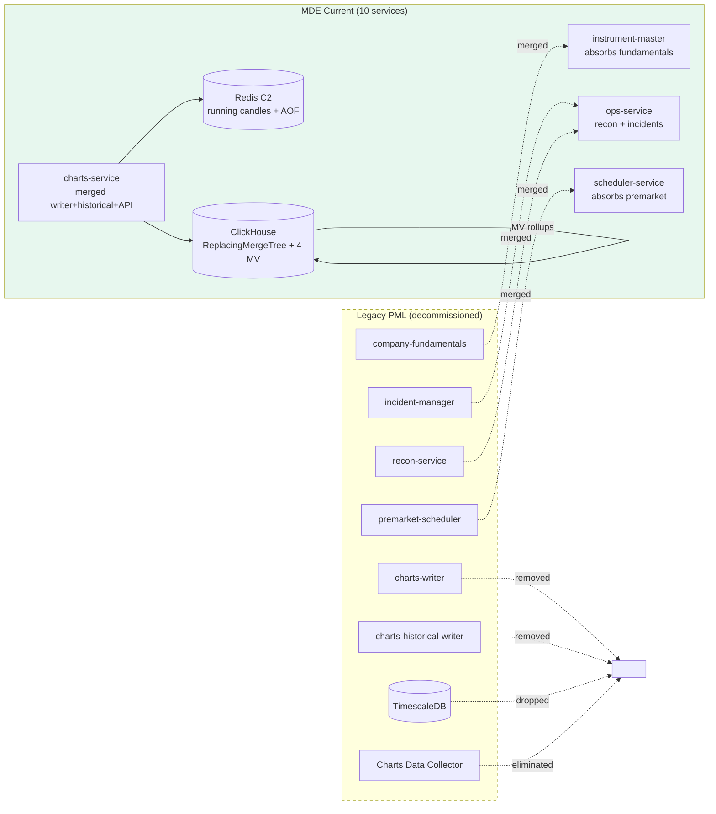

<Info>
**April 2026 — v3 consolidated.** MDE consolidated from 15 to 10 deployable services. TimescaleDB completely removed. ClickHouse is the sole time-series store (ReplacingMergeTree + 4 MV rollups). Two Redis clusters: C1 (real-time snapshots) and C2 (candles + movers + FNO + alerts). 38 gap-closure tasks tracked for production readiness.
</Info>

### Cut-over at a glance



---

## 11. Technology Stack

| Component | Technology | Purpose |
| --- | --- | --- |
| Language | Java 21 | All services, virtual threads |
| Framework | Spring Boot 3.2 | Web, Kafka, Redis, actuator |
| Message Broker | Apache Kafka (MSK) | Inter-service messaging, 8 topics |
| Cache/State | Redis ElastiCache | Two clusters: C1 (snapshots), C2 (candles/movers/FNO/alerts) |
| Time-Series DB | ClickHouse | Historical candles, ReplacingMergeTree + 4 MV rollups |
| Relational DB | PostgreSQL (RDS) | Instruments, alerts, corporate actions, ops |
| Workflow | Temporal | BOD preload, corporate action pre-computation, recon |
| Serialization | Protocol Buffers | Tick data serialization (feed-handler to Kafka) |
| Container | Docker (Jib) | All services, Temurin 21 base |
| Orchestration | Kubernetes (EKS) | 10 services, HPA for broadcast-service |
| Monitoring | Prometheus + Grafana | 8 dashboards, Micrometer metrics |
| Tracing | Brave/Zipkin | Distributed tracing across services |

---

## 12. Deployment Architecture

### 10 Consolidated Services

MDE reduced from 15 services to 10 through four consolidation merges:

| Merge | Before | After | Rationale |
| --- | --- | --- | --- |
| Charts consolidation | `charts-writer` + `charts-historical-writer` + `charts-api` | `charts-service` | Single service owns entire candle lifecycle: aggregation, ClickHouse storage, and API serving |
| Ops consolidation | `recon-service` + `incident-manager` | `ops-service` | Recon and incident management share operational context |
| Scheduler consolidation | `premarket-scheduler` (standalone) | `scheduler-service` | Temporal worker with two task queues replaces standalone scheduler |
| Fundamentals consolidation | `company-fundamentals` (standalone) | `instrument-master` | Fundamentals are instrument metadata, not a separate domain |

### Deployment Groups

```
Always-On (7 services, run during market hours + extended):
    feed-handler          — binary packet decoder, LZO decompression
    publisher             — headless Redis C1 writer, no HTTP API
    broadcast-service     — WebSocket fan-out, HPA 3-10 pods (5000 conn/pod)
    charts-service        — candle aggregation + ClickHouse writes + API
    market-movers-writer  — consumes 1m candles, ZSET ranking writes
    fno-data-writer       — Greeks computation, IV solver, option chain
    alert-engine          — user alert evaluation, Redis index reconciliation

Scheduled (1 service, runs Temporal workflows):
    scheduler-service     — BOD preload, corporate action pre-computation
                            two task queues: scheduler-queue, premarket-queue

Ops (1 service, always running):
    ops-service           — recon + incidents + self-healing
                            market-hours awareness, auto-heal only off-market

Infra (1 service, always running):
    instrument-master     — instrument + fundamentals CRUD, bhavcopy parsing
                            ConcurrentHashMap in-memory cache, Kafka reload

Databases & Stores (managed, not service pods):
    PostgreSQL (RDS)      — instrument_master, alert_engine, scheduler_service,
                            ops_service, temporal
    Redis Cluster 1 (C1)  — real-time snapshots (FEED_PP, OHLC, PC, LC_UC,
                            52WK, DEPTH, MKT_STATUS), RDB persistence
    Redis Cluster 2 (C2)  — candles + movers + FNO + alerts, AOF persistence
    ClickHouse (3-node)   — candles_1m ReplacingMergeTree + 4 MV rollups
    Kafka (MSK 3-broker)  — 8 topics

Temporal Workers (reliability over latency):
    Instrument Master Sync (daily)
    BOD Preload (pre-market)
    Corporate Action Pre-Computation (T-1)
    Post-Market Reconciliation (EOD)
```

---

## 13. Migration Strategy

Strangler fig pattern — **5 phases** from legacy PML to production MDE.

### Phase 1 — Core Pipeline (DONE)

Feed-handler to publisher to Redis C1. Kafka tick topics. Basic broadcast-service. Instrument-master with PostgreSQL.

- All services built and tested locally.
- Feed simulator producing realistic tick data.
- Redis C1 snapshots verified against legacy PML output.

### Phase 2 — Gap Closure (38 tasks)

Covers all legacy PML features that are not yet implemented in MDE. Tracked as TASK-01 through TASK-38 (see Business Rules Checklist below for full breakdown).

Key areas:
- Feed handling: LZO decompression, OI injection, zero-LTP fallback, cross-minute resend, previous-close enrichment, post-close timing
- Publishing & broadcast: market status, BSE circuit limits, unique consumer groups, inverted subscription index, heartbeat, connection limits
- Charts: Redis-first candle writes with AOF, ClickHouse fallback, partition scaling
- Market movers: switch from ticks to 1-minute candle consumption
- FNO: max pain, ATM straddle, PCR, day-over-day changes, BSE F&O
- Alerts: Redis index reconciliation, 52-week conditions
- Premarket/BOD: direct exchange downloads, BSE bhavcopy, F&O bhavcopy, security ban list, BSE circuit limits from DP file
- Corporate actions: T-1 pre-computation, atomic partition swap, verification workflow

### Phase 3 — Service Consolidation (15 to 10)

Four consolidation merges (see Deployment Architecture above):
1. Charts consolidation (writer + historical + API into charts-service)
2. Ops consolidation (recon + incident-manager into ops-service)
3. Scheduler consolidation (premarket-scheduler into scheduler-service)
4. Fundamentals consolidation (company-fundamentals into instrument-master)

### Phase 4 — Production Readiness

- Comprehensive test suite (unit + integration + E2E)
- Production observability (Prometheus metrics, structured logging, distributed tracing)
- 8 Grafana dashboards (see DevOps Guide)
- E2E Docker Compose validation
- Load testing with k6

### Phase 5 — Production Release

- Merge to `main` branch
- Bitbucket push
- ArgoCD deployment to staging
- Bake-off validation against legacy PML
- Production cutover with canary at 1%

---

## 14. Monitoring & Observability

### Prometheus Metrics

All 10 services expose metrics via Micrometer on management port (9xxx). Metric naming convention: `mde_{service}_{metric}`.

| Metric | Type | Labels | Description |
| --- | --- | --- | --- |
| `mde_feed_handler_packets_received` | Counter | exchange, packetCode | Packets received per exchange |
| `mde_feed_handler_decode_errors` | Counter | exchange, errorType | Packet decode failures |
| `mde_feed_handler_lzo_latency` | Histogram | exchange | LZO decompression latency |
| `mde_publisher_redis_write_latency` | Timer | operation, keyType | Redis C1 hash op latency |
| `mde_publisher_kafka_produce_latency` | Timer | topic | Kafka produce latency |
| `mde_publisher_dedup_count` | Counter | source | Ticks dropped by dedup |
| `mde_broadcast_active_connections` | Gauge | platform | WebSocket connections |
| `mde_broadcast_message_latency` | Histogram | -- | Kafka consume to WS send |
| `mde_broadcast_slow_evictions` | Counter | -- | Slow consumer evictions |
| `mde_broadcast_kafka_lag` | Gauge | topic, partition, group | Consumer lag |
| `mde_charts_candles_per_min` | Counter | exchange, segment | 1m candles aggregated |
| `mde_charts_clickhouse_insert_latency` | Histogram | table | ClickHouse batch insert latency |
| `mde_charts_api_query_latency` | Histogram | endpoint, source | API query latency by source |
| `mde_charts_cache_hit_ratio` | Gauge | endpoint | Cache hit ratio per endpoint |
| `mde_movers_signals_per_sec` | Counter | category | Market mover signals processed |
| `mde_movers_zset_writes` | Counter | category | Redis ZSET write operations |
| `mde_fno_greeks_compute_duration` | Histogram | exchange | Greeks computation time |
| `mde_fno_iv_solver_iterations` | Histogram | exchange | IV solver iteration count |
| `mde_alert_active_count` | Gauge | conditionType | Active alerts by type |
| `mde_alert_triggered_total` | Counter | conditionType | Alerts triggered |
| `mde_ops_recon_mismatches` | Counter | exchange, segment | Recon mismatch count |
| `mde_ops_auto_heal_actions` | Counter | actionType, success | Auto-heal actions taken |
| `mde_scheduler_execution_time` | Timer | jobName | Scheduler job duration |

### Grafana Dashboards (8 dashboards)

| # | Dashboard | Key Panels |
| --- | --- | --- |
| 1 | **MDE Overview** | 10 service health, key TPS gauges, data flow, error rate |
| 2 | **Feed Handler & Publisher** | Packets/sec, decode errors, LZO latency, Redis write latency |
| 3 | **Charts Pipeline** | Candles/min, ClickHouse batch insert rate, API query latency, cache hit ratio |
| 4 | **Market Movers & FNO** | Signals/sec, ZSET writes, Greeks compute duration, IV solver iterations |
| 5 | **Broadcast Service** | WebSocket connections, messages/sec, slow consumer evictions, Kafka lag |
| 6 | **Alerts & Operations** | Active alerts, triggered/min, recon mismatches, auto-heal actions |
| 7 | **Infrastructure** | Kafka, Redis C1/C2, ClickHouse, PostgreSQL, JVM metrics |
| 8 | **Business KPIs** | Live instrument count, data freshness, BOD completeness, market hours |

### Slack Alerting

| Alert | Priority | Webhook |
| --- | --- | --- |
| NSE Direct feed down (heartbeat lost) | P0 | `slack.p0.webhook` |
| Omnenest feed down | P0 | `slack.p0.webhook` |
| Both feeds down | P0 + PagerDuty | `slack.p0.webhook` |
| Feed source UNCERTAIN (staleness) | P1 | `slack.p1.webhook` |
| Trading day status missing | P0 | `slack.p0.webhook` |
| Pclose reconciliation critical mismatch | P0 | `slack.p0.webhook` |
| Scheduler job overdue | P0 | `slack.p0.webhook` |
| All scheduler jobs completed | INFO | `slack.info.webhook` |
| Kafka consumer lag > threshold | P1 | `slack.p1.webhook` |
| ClickHouse merge queue backlog > threshold | P1 | `slack.p1.webhook` |
| Auto-remediation triggered | INFO | `slack.incidents-audit.webhook` |
| Auto-remediation failed | P1 | `slack.p1.webhook` |

### Logging

- **Format:** JSON (Logstash Logback encoder)
- **MDC fields:** `service`, `traceId`, `spanId`, `instrumentToken`
- **Distributed tracing:** Micrometer Tracing + Brave/Zipkin, Kafka message headers carry `traceId` for log correlation
- **Marker-based appenders** (separate rolling log files per packet type):

TRADE, INDEX, OHLC, MBP, TOP_BID_ASK, MKT_STATUS, PCLOSE, CKT, F52WK

---

## 15. Business Rules Checklist

An engineer building this system must implement all of the following. Items marked with `[x]` are complete (Phase 1). Items marked with `[ ]` are gap-closure tasks tracked as TASK-01 through TASK-38.

### Premarket / BOD

- [x] Temporal BOD workflows
- [x] NSE bhavcopy parsing
- [ ] Direct download from exchange URLs (TASK-01)
- [ ] Fix pmlId placeholder (TASK-02)
- [ ] BSE bhavcopy support (TASK-03)
- [ ] NSE F&O bhavcopy support (TASK-04)
- [ ] F&O security ban list (TASK-05)
- [ ] BSE circuit limits from DP file (TASK-06)

### Corporate Actions

- [ ] T-1 pre-computation with shadow tables (TASK-07)
- [ ] Atomic partition swap on ex-date
- [ ] Verification workflow with auto-rollback

### Feed Handling

- [x] NSE/BSE binary packet decoding
- [x] Protobuf serialization
- [x] Source deduplication
- [x] Market status state machine
- [ ] LZO decompression for compressed NSE packets (TASK-08)
- [ ] OI injection into MBP trade ticks (TASK-09)
- [ ] Zero-LTP fallback for pre-open session (TASK-10)
- [ ] Cross-minute re-send for deduplicated ticks (TASK-11)
- [ ] Previous-close enrichment for index ticks (TASK-12)
- [ ] Post-close timing window for closing auction (TASK-13)

### Publishing & Broadcast

- [x] Redis snapshot writes (6 key types)
- [x] WebSocket fan-out
- [ ] Market status Redis key (TASK-14)
- [ ] BSE circuit limits from MBP packet (TASK-15)
- [ ] Unique Kafka consumer group per pod (TASK-16)
- [ ] Inverted subscription index (TASK-17)
- [ ] Market status broadcasting (TASK-18)
- [ ] Server-to-client heartbeat (TASK-19)
- [ ] Per-pod connection limit (TASK-20)

### Charts Pipeline

- [x] 1-minute candle aggregation
- [x] ClickHouse historical storage
- [ ] Redis-first 1m candle writes with AOF (TASK-21)
- [ ] Charts-API ClickHouse fallback (TASK-22)
- [ ] Partition-based horizontal scaling (TASK-23)

### Market Movers

- [x] Signal computation (8 categories)
- [x] ZSET ranking writes
- [ ] Switch from ticks to 1-minute candles (TASK-24)

### FNO Analytics

- [x] Black-Scholes Greeks
- [x] Option chain writes
- [ ] Max Pain calculation (TASK-25)
- [ ] ATM Straddle computation (TASK-26)
- [ ] Put-Call Ratio (OI + Volume) (TASK-27)
- [ ] Day-over-day change fields (TASK-28)
- [ ] BSE F&O support (TASK-29)

### Alerts

- [x] User alert management
- [x] 7 condition types
- [ ] Redis index reconciliation on restart (TASK-30)
- [ ] 52-week conditions from BOD reference data (TASK-31)

### Operations

- [ ] Autonomous operations hub (TASK-32)
- [ ] Market-hours awareness (auto-heal only off-market)
- [ ] Canary deployment at 1%

### Production Readiness

- [ ] Service consolidation 15 to 10 (TASK-33)
- [ ] Comprehensive test suite (TASK-34)
- [ ] Production observability (TASK-35)
- [ ] Grafana dashboards (TASK-36)
- [ ] E2E Docker Compose validation (TASK-37)
- [ ] Production release (TASK-38)

### Cross-Cutting (implemented in Phase 1)

- [x] One virtual thread per UDP stream (12 total -- 6 NSE Direct + 6 Omnenest)
- [x] Buffer size: 8192 bytes per datagram
- [x] Drop malformed packets silently (log warn), never crash receiver thread
- [x] Parse BCastHeaderBroadcast (64 bytes) first, route by packetCode
- [x] Set uniqueSequenceId as MDC traceId for every packet
- [x] Dedup by (instrumentId, timestamp) -- first arrival wins
- [x] MBP valid trade gate: volume > 0 AND market OPEN or POST_CLOSE_START
- [x] OHLC: Lua atomic updates
- [x] 52-week: Lua atomic updates
- [x] Redis batch flush on: queue > max batch size OR 10ms timeout
- [x] Two separate Redis clusters: C1 (Feed) and C2 (API)
- [x] maxmemory-policy noeviction on C2
- [x] Kafka: enable.idempotence=true, acks=all, partition key = instrumentToken
- [x] Market status tracked per (ExchangeSegment, marketType) pair
- [x] POST_CLOSE_START (5.0) is valid trading state
- [x] Heartbeat-based feed failover: 3 seconds timeout
- [x] All schedulers skip non-trading days
- [x] Instrument master in dedicated PostgreSQL instance
- [x] Services load instrument map into ConcurrentHashMap on startup
- [x] Pclose reconciliation: compare Redis vs exchange bhavcopy from S3
- [x] Expiry day cleanup: mark expired contracts, clean Redis C2, stop Greeks, recalculate PCR/Max Pain

---

## 16. Services Being Replaced

| Legacy PML Service | MDE Service | Notes |
| --- | --- | --- |
| Streamer (pml-core-streamer) | `feed-handler` | Binary packet decoder |
| Market Feed Publisher | `publisher` | Redis C1 writes |
| Tick Producer (pml-core-tick-producer) | `publisher` | Kafka publishes (merged into publisher) |
| Charts Data Writer (charts-data-writer) | `charts-service` | Writes to ClickHouse + Redis C2 |
| Charts Historical Writer | `charts-service` | Merged into charts-service |
| Charts Data Collector | **ELIMINATED** | ClickHouse materialized views replace it |
| Charts API (data-price-charts-api) | `charts-service` | Reads ClickHouse + Redis C2 |
| FNO Data Writer (fno-data-writer) | `fno-data-writer` | Greeks, IV, option chain |
| Market Movers Data Writer | `market-movers-writer` | ZSET ranking writes |
| FNO Dashboard API | `fno-data-writer` | API merged into writer |
| Market Movers API | `market-movers-writer` | API merged into writer |
| Feed Broadcast (pml-core-feed-broadcast) | `broadcast-service` | WebSocket fan-out |
| Company Fundamentals | `instrument-master` | Absorbed into instrument-master |
| Job Manager (CMOTS loader) | `scheduler-service` | Temporal workflows |
| Incident Manager (standalone) | `ops-service` | Merged with recon |

**Result:** 15 legacy services consolidated into 10 MDE services. Charts Data Collector eliminated entirely (ClickHouse materialized views). 4 explicit merges, 1 elimination.
